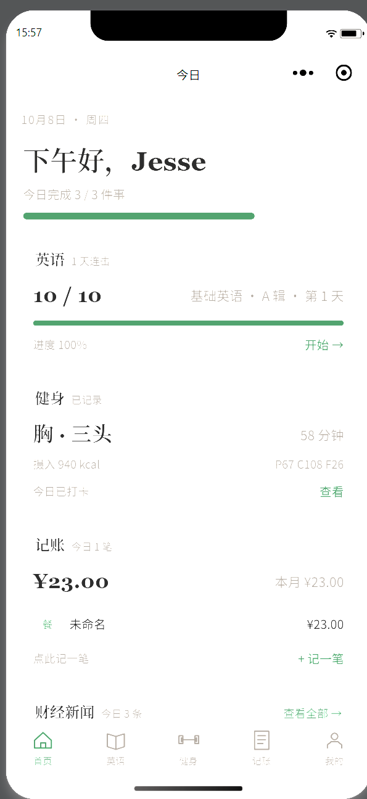
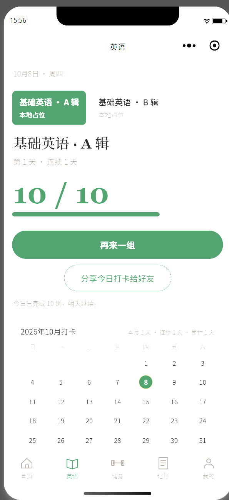
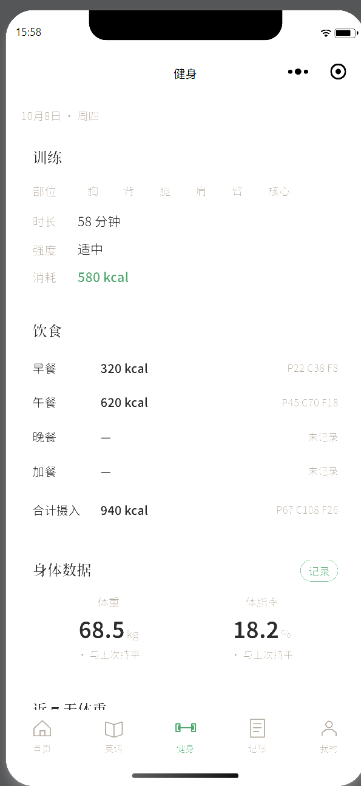
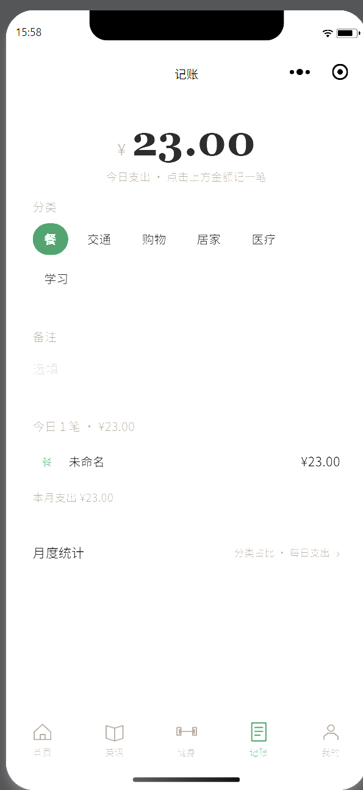
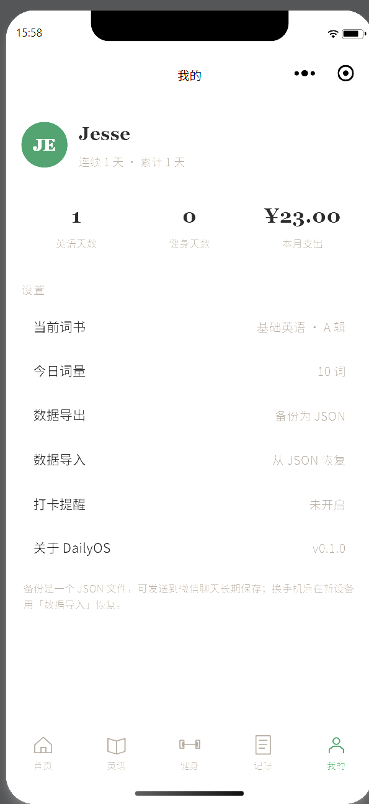

# DailyOS · 微信小程序

个人日常管理小程序：**英语打卡**（带错词本复习）、**健身记录**、**记账**、**财经资讯**。

- 技术栈：原生微信小程序（无框架、无第三方依赖），ES6 + `wx.getStorageSync` 本地存储
- AppID：`wx1ac3e868f6f662ab`
- 后端：可选。`utils/config.js` 里配了 `http://127.0.0.1:8080/api/v1`，**后端没起也能跑**（自动回落本地占位数据）

## 界面预览

| 首页 | 英语打卡（含本月打卡日历） | 健身记录 |
|---|---|---|
|  |  |  |

| 记账（含月度统计入口） | 我的（统计 / 打卡提醒 / 数据备份） |
|---|---|
|  |  |

> 截图为微信开发者工具模拟器实拍，数据是真实使用记录。

## 功能一览

| 模块 | 能力 |
|---|---|
| 首页 | 今日聚合：英语打卡进度 / 健身记录 / 记账今日+本月+最近几笔 / 财经资讯 |
| 英语 | 多词书切换、每日打卡（翻卡背单词）、**错词本**（答错自动收录，连对 2 次毕业）、打卡日历、分享给好友/朋友圈 |
| 健身 | 训练部位与时长、三餐宏量（P/C/F）统计、**每日历史记录**、真实体重趋势图（canvas）、本周次数与时长 |
| 记账 | 自绘数字键盘记账、分类/类型切换、编辑与删除、**月度统计页**（收支结余 + 分类占比 + 每日支出柱状） |
| 我的 | 真实统计（打卡天数、健身天数、本月支出）、**打卡提醒（订阅消息）**、**数据导出/导入（JSON 备份）** |

## 目录结构

```
├── app.js / app.json / app.wxss     全局入口、页面与 tabBar 注册、设计令牌
├── pages/
│   ├── index/                       首页（今日概览）
│   ├── english/
│   │   ├── index.*                  英语首页（词书、进度、日历、错词本入口、分享）
│   │   ├── study/index.*            打卡页（翻卡、认识/不认识）
│   │   └── wrong/index.*            错词本
│   ├── fitness/index.*              健身
│   ├── account/
│   │   ├── index.*                  记账
│   │   └── month/index.*            月度统计（分类占比 / 每日支出）
│   ├── profile/index.*              我的（统计 + 提醒 + 备份）
│   └── news/article/index.*         资讯详情（web-view）
├── components/                      card / progress-bar / section-header
├── utils/
│   ├── store.js                     ⭐ 统一数据层（storage key、读写、统计计算）
│   ├── backup.js                    数据导出/导入（纯逻辑 + 文件读写）
│   ├── notify.js                    打卡提醒（订阅消息授权与额度记录）
│   ├── words.js                     词书数据层（远端优先，失败回落本地占位）
│   ├── request.js                   网络封装（Result 包装、withFallback 降级）
│   ├── config.js                    环境、后端地址、订阅消息模板 ID
│   ├── date.js / format.js          日期与格式化工具
│   └── mock.js                      首页/新闻的占位数据
└── scripts/                         开发辅助（不参与打包，见 packOptions.ignore）
    ├── test-store.js                数据层回归测试
    ├── test-backup.js               备份回归测试
    ├── test-wrong.js                错词本回归测试
    ├── test-notify.js               提醒模块回归测试
    ├── test-month.js                月度统计回归测试
    ├── test-fitness.js              健身历史回归测试
    ├── check-project.js             静态检查：页面注册 / 事件方法 / wx:if 混用 / 敏感信息
    ├── check-size.js                打包体积守卫（主包 2MB 上限）
    ├── upload.js                    miniprogram-ci 上传骨架
    └── gen-tab-icons.ps1            tabBar 图标生成脚本
```

## 本地开发

1. 微信开发者工具 → 导入项目 → 选择本目录（AppID 会自动读出来）
2. 改动即热重载（`project.private.config.json` 里 `compileHotReLoad: true`）

> `project.private.config.json` 是**本机私有配置，已加入 .gitignore**，不要提交。

## 质量守卫（每次改完建议跑一遍）

```bash
npm run verify     # = test + check + size
# 或分开跑：
npm test           # 6 个回归测试：数据层 / 备份 / 错词本 / 提醒 / 月度统计 / 健身历史
npm run check      # 静态检查（页面注册、事件方法、wx:if 与 wx:for 混用、密钥泄漏）
npm run size       # 打包体积守卫
```

测试脚本**零依赖**（只用 Node 内置模块），所以 CI 不需要 `npm install` —— 见 `.github/workflows/ci.yml`。目前共 **178 项断言**（29 + 31 + 33 + 28 + 28 + 29）。

`check-project.js` 覆盖的都是真实踩过的坑：

- 页面没写进 `app.json` 的 `pages` → `wx.navigateTo` 会**静默失败**（点了没反应）
- WXML 绑定了方法但 JS 里没定义（例如 `catchtap="noop"` 忘了实现）
- 同一标签上同时用 `wx:if` 和 `wx:for` → `wx:for` 优先，后面的 `wx:else` 找不到配对
- `wx:else` 前面没有配对的 `wx:if`
- 组件注册在 `usingComponents` 里却没用（微信「代码质量」会报"无使用的组件"）
- 组件路径写错、页面缺文件（js/json/wxml/wxss 四件套）
- 硬编码 AppSecret / token

## 数据存储与备份

所有数据存在**手机本地 Storage**，共 9 个 key（统一在 `utils/store.js` 的 `KEYS` 里定义）：

| key | 内容 |
|---|---|
| `english.book.v1` | 当前词书 |
| `english.today.v1` | 今日打卡会话（队列、进度、认识/不认识） |
| `english.history.v1` | 打卡历史日期数组（驱动连续天数与日历） |
| `english.wrong.v1` | 错词本 |
| `account.records.v1` | 记账记录 |
| `fitness.today.v1` | 今日健身记录 |
| `fitness.history.v1` | 健身每日历史（驱动本周次数、体重趋势、我的页统计） |
| `notify.settings.v1` | 提醒偏好与订阅授权额度 |
| `user.profile.v1` | 昵称等资料 |

**导出/导入**：「我的 → 数据导出」生成 JSON 文件，可发送到微信聊天（建议发给文件传输助手）或复制到剪贴板；新设备用「数据导入」恢复，支持**合并**（按记录 id 去重、打卡历史取并集）与**覆盖**两种模式。

> ⚠️ 目前是**纯本地存储**：卸载小程序 / 清除缓存会丢数据（所以有了导出/导入）。多设备实时同步需要接后端——`store.js` 已经把读写收口，**切换数据源只需改这个文件里的 `read()` / `write()`**（届时需要改成异步，或采用「本地优先 + 后台同步」）。

## 打卡提醒（订阅消息）

前端已完成：「我的 → 打卡提醒」可开启/关闭、发起微信授权、记录**可发送次数**（一次性订阅：授权一次 = 可发 1 条），并限制同一自然日只弹一次授权。

**但真正把消息发出去需要服务端**，原因：

1. 调用 `subscribeMessage.send` 需要 `access_token`，而它由 **AppSecret** 换取 —— AppSecret 绝不能放进小程序
2. 服务端还需要知道"谁的额度还剩几次"，这要把授权结果上报并和 `openid` 绑定（小程序 `wx.login` → code → 后端换 openid）

需要做的三件事：

1. **配置模板**：微信公众平台 → 功能 → 订阅消息 → 选用模板，把模板 ID 填进 `utils/config.js` 的 `notifyTmplIds.dailyCheckin`（留空时点"开启提醒"会给出明确提示，不会报错）
2. **加上报接口**：`POST /notify/subscribe`，字段 `{ code, templateKey, accepted }`，服务端换 openid 并累计额度
3. **加定时任务**：每天到提醒时间检查"今天是否已打卡"，未打卡且额度 > 0 就调 `subscribeMessage.send` 并扣减额度

待发内容的结构已由 `utils/notify.js` 的 `buildReminderPayload()` 定义好（含 `shouldSend` / `done` / `target` / `streak` 与模板字段），服务端可直接复用：

```json
{ "templateKey": "dailyCheckin", "date": "2026-10-08", "shouldSend": true,
  "done": 3, "target": 10, "streak": 2,
  "data": { "thing1": { "value": "基础英语 · A 辑" }, "number2": { "value": "3" }, "number3": { "value": "10" } } }
```

## 上线前必须处理（发布阻塞项）

1. **小程序备案**：发布硬门槛，管局审核 1–20 个工作日，越早越好
2. **服务器域名**：`utils/config.js` 里 prod 地址目前是占位 `api.dailyos.example.com`，必须换成真实 HTTPS 且已完成 ICP 备案的域名，并在公众平台配置 `request` 合法域名
3. **业务域名**：资讯详情页用了 `web-view`，对应的第三方域名必须配置**业务域名**并上传校验文件，否则真机打不开
4. **隐私保护指引**：目前没有采集个人信息，一旦加入登录 / 头像 / 手机号就必须配置
5. **内容合规**：`web-view` 打开的第三方内容需自行确保合规；禁止诱导分享（"分享才能解锁"这类写法）

## 提交规范

```
feat(english): 新增错词本
fix(account): 修复数字键盘点不动
refactor: 抽出统一数据层 utils/store.js
docs: 补充 README
```

## 版本

`v0.1.0`
